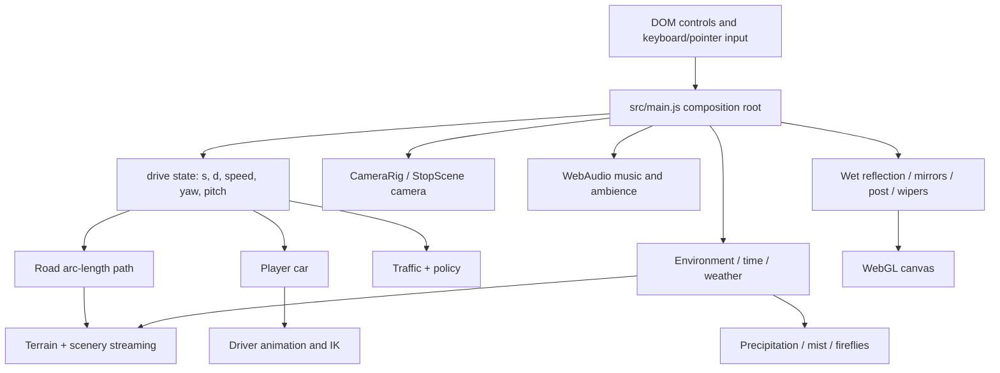

# Chill Drive → GameStudio WebGPU: Feature Parity Audit

**Audit date:** 2026-10-07

**Scope:** source and architecture audit only. No runtime feature was implemented in this round.

**Original runtime:** project root (`src/`, `docs/`, `scripts/`).

**Target editor/runtime:** `experiments/webgpu/`.

## 1. Audit rules and evidence

This audit treats an implementation as present only when its runtime path exists in source. README names were cross-checked against constructors, update calls, input handlers, state transitions, renderer APIs, assets, and focused check scripts.

The original Chill Drive source was not modified. The current GameStudio baseline was inspected without replacing its WebGPU renderer, Rapier integration, editor state, autosave, Character Control, Landscape/Terrain/Water, Lighting/Time/Camera/DOF, or existing assets.

Primary evidence:

- Build and entry: `package.json`, `build.mjs`, `docs/index.html`, `src/main.js`.
- Original runtime systems: all files in `src/`, especially `road.js`, `terrain.js`, `scenery.js`, `cars.js`, `traffic*.js`, `person.js`, `camera.js`, `world.js`, `post.js`, `ocean.js`, and `audio.js`.
- Original focused checks: `scripts/check-*.mjs` and preview scripts.
- GameStudio baseline: `experiments/webgpu/main.js`, `editor/modules/CharacterController.js`, `PhysicsModule.js`, `LandscapeModule.js`, and `LightingModule.js`.
- Asset inventory: `docs/assets/` and `experiments/webgpu/public/`.

## 2. Original Chill Drive architecture discovered

### Build and entrypoint

- `build.mjs` bundles `src/main.js` to `docs/app.js` and `src/style.css` to `docs/style.css` with esbuild.
- `docs/index.html` is the deployed shell. It exposes the canvas, start overlay, runtime HUD, mode buttons, tuning panels, mobile rotation prompt, and credits.
- The renderer is `THREE.WebGLRenderer` from Three.js `0.160.0`. It uses ACES tone mapping, shadows, render targets, GLSL `ShaderMaterial`, `onBeforeCompile`, and `ShaderChunk` patching.
- `src/main.js` is the composition root and owns global runtime state, input, UI bindings, map/car/character selection, update order, camera handoff, and render orchestration.

### Actual runtime state path

The original driving model is path based, not a rigid-body vehicle simulation:

1. Keyboard input changes target speed and lateral steering intent in `src/main.js`.
2. `drive.s` advances along the procedural arc-length path; `drive.d` moves laterally inside road bounds.
3. `Road.at(s)` returns center position, elevation, and heading. `main.js` derives player position, slope pitch, and yaw from the road sample plus lateral velocity.
4. `Cars.update()` applies the resulting pose, wheel rotation, steering, body lean, lights, and model-specific parts.
5. `TrafficPolicy` and `traffic-ai.js` constrain player/NPC lanes and speeds before the next pose is produced.
6. `CameraRig.update()` follows the resulting car pose. `StopScene` temporarily becomes camera owner during the park/exit sequence.

The main frame then updates, in order, player/driver/stop camera, environment, scenery/ocean/waterfalls/vegetation/terrain/nature, traffic/town, lights/audio, cinematic shake, fog uniforms, wet reflection, mirrors/wipers, and finally the post-processing chain.

### State and persistence

- Runtime selection state lives in the `state` object in `src/main.js`; drive state lives in `drive`.
- Only quality and live tuning are persisted (`localStorage`, including `chilldrive.tuning.v1`). The original is a game runtime, not a scene authoring format.
- Car definitions and calibration data are declarative in `src/config.js`: model path, dimensions, orientation, eye position, wheel/door node patterns, seat/foot/steering anchors, lamps, and material overrides.
- Map, weather, time, camera, music, lens, and quality presets are also declarative in `src/config.js` or profile objects in their owning systems.

## 3. Original system inventory

| System | Source | What is actually implemented | Key coupling |
| --- | --- | --- | --- |
| Drive | `src/main.js` | Arc-length progress, target speed/gears, lane steering, lane return, pitch/yaw from road, opening sequence, stop integration | Road, traffic controller, car pose, camera |
| Road | `src/road.js` | Deterministic infinite centerline, elevation sampling, curvature, dirt segments | Imports terrain height function |
| Vehicle | `src/cars.js`, `config.js`, `headlights.js` | GLB probing/loading/cache, normalization, wheel/steering/door/glass discovery, per-car calibration, lights, body dynamics | Three WebGL materials, mist shader patch, driver/mirrors/dashboard |
| Traffic/NPC | `src/traffic.js`, `traffic-ai.js`, `traffic-policy.js`, `carriage.js` | Two-way spawn/pooling, lane decisions, following/overtaking/avoidance, curve speed, carriage, lights, pass-by audio | Road coordinates, car dimensions, player obstacles |
| Character/driver | `src/person.js`, `stopscene.js`, `smoke.js` | Animated driver, rig retargeting, character replacement, two-bone arm/leg IK, head/neck control, exit/walk/smoke/return state machine | Car seat/steering calibration and animation clip names |
| Camera | `src/camera.js`, camera code in `main.js` | Six camera modes, look/zoom, ground clamp, per-mode lens settings, two-second transitions, true driver-eye callback, stop-scene orbit | Car dimensions/pose, terrain/ocean height, Person head |
| Terrain | `src/terrain.js`, `terrain-noise.js` | Deterministic multi-scale height field, streamed quadtree tiles, road carve, mountain side/ravine logic, trees/rocks, map profiles | CPU and matching GLSL noise, road samples, ocean level |
| Road scenery | `src/scenery.js`, `textures.js` | Streamed road chunks, asphalt/dirt, posts, guardrails, streetlights, wet-road material and lamp selection | Road, map, wet reflection, environment state |
| Vegetation/nature | `src/reeds.js`, `nature.js`, terrain tree code | Instanced reeds/grass/meadow, wind, road exclusion, near GLB trees/rocks, billboard fallback | GLSL injection, terrain noise, quality radius |
| Ocean | `src/ocean.js`, `scripts/bake-ocean.mjs` | Baked 76-frame wave atlas, two-layer seam blending, world-stable tiled mesh, shore/depth behavior | `onBeforeCompile`, road samples, map sea level |
| Streams/waterfalls | `src/waterfalls.js` | Seeded stream geometry from mountain to road/ravine, wet banks, rocks, foam/splash particles, vehicle splash and water audio | Road, terrain, environment light, traffic/player positions |
| Weather | `src/world.js`, `particles.js` | Seven interpolated profiles, rain/snow/wind/fog/storm, lightning/thunder, wet/snow cover state | Custom GLSL sky/cloud/precipitation, audio callback |
| Time/lighting | `src/world.js`, `headlights.js`, `scenery.js` | Day/night clock, sun/moon, sky keys, exposure, PMREM environment capture, shadows, vehicle and street lights | Renderer/PMREM, weather profiles, camera focus |
| Mist/fog | `src/mist.js`, `main.js` | Height fog with coverage/density/wind/color and shared material uniforms | Global Three `ShaderChunk` replacement and material injection |
| Reflection/mirrors | `reflection.js`, `mirror.js`, `wingmirrors.js` | Wet planar reflection, rear mirror render target, two planar wing mirrors | WebGL render targets and renderer state |
| Post/cinematic | `src/post.js`, `main.js` | Scene RT, MSAA, bloom, color grade, film grain, vignette, ray pass, physical-lens DOF, speed blur, glass mask | Multi-pass GLSL/WebGL render-target pipeline |
| Wipers/glass rain | `src/wipers.js`, `cars.js`, `post.js` | Rain-driven 3D wiper angle, windshield/rear-glass wet mask and wipe regions | Car glass discovery plus post uniforms/mask pass |
| Audio | `src/audio.js` | Procedural lo-fi music, engine/tire/wind/rain/cabin filtering, pass-by Doppler, waterfall/splash/thunder | WebAudio and runtime state only; renderer independent |
| World set dressing | `town.js`, `cows.js`, `fireflies.js`, `smoke.js`, `nature.js` | Seeded towns/lights, animated cattle/fences, night fireflies, cigarette smoke, near-detail assets | Map/time/weather/terrain and several GLSL materials |
| Interaction/UI | `docs/index.html`, `src/main.js`, `style.css` | Keyboard/touch/mouse driving, runtime preset cycling, live camera/weather/time/light tuning, fullscreen/mobile behavior | Direct DOM callbacks; no generic command/action layer |
| Quality/performance | `config.js`, `main.js`, streaming systems | Low/Good/Ultra resolution, MSAA, vegetation density, shadows, reflections, DOF samples, near-detail/view radius | Per-system setters and renderer rebuild/warmup |

## 4. Assets actually used

The original runtime includes compressed player cars and characters, a carriage, near-detail nature, an ocean source model and baked wave atlas, and terrain surface textures. Important sizes observed in `docs/assets/`:

- `mustang.glb` 1.5 MB; `mazda-rx-vision.glb` 19 MB.
- `person.glb` 524 KB; `chisa_wuthering_waves.glb` 21 MB.
- `carriage.glb` 1.6 MB; `nature.glb` 1.0 MB.
- `ocean_scene_animated.glb` 12 MB; baked `ocean-waves.png` 2.5 MB.
- Terrain textures total under 400 KB; full `docs/assets/` is about 113 MB because it also contains alternates/source-like assets.

GameStudio currently exposes only `venom.glb` in `experiments/webgpu/public/models/`. A future implementation must copy only the curated compressed assets needed by an approved milestone into `experiments/webgpu/public/`; it must not mutate or serve the original `docs/` asset tree as editor-owned content.

## 5. GameStudio current architecture and editability

### Current runtime

- `experiments/webgpu/main.js` creates `THREE.WebGPURenderer`, a TSL `RenderPipeline`, OrbitControls, TransformControls, basic scene/fog/time/light state, and the editor DOM.
- Rapier is initialized by `PhysicsModule.js`. Global Physics starts OFF. Ground and the straight Road plane are fixed colliders. Water is excluded from collider creation. Landscape/built-ins auto-resolve to static.
- Character Control owns a real Rapier capsule while active. It drives linear/angular velocity for W/S/Q/E and jumps with Space; third-person and first-person camera ownership disables OrbitControls.
- The editor has only four extracted modules. Asset registry, selection, object actions, import, persistence, material tools, terrain generation, water animation, camera, light placement, render loop, and most event binding still live in `main.js`.

### Current editor capabilities

| Area | Present now | Material limitation |
| --- | --- | --- |
| Character/Vehicle assets | Category-filtered cards and viewport picking; import GLB; select; move; hide/show; lock; unload/load defaults; delete/restore/purge defaults; duplicate; material/texture/physics controls | Imported Blob URLs, duplicates, lights, and created object graphs are not reconstructed after reload |
| Selection | Cards dispatch `data-select`; viewport raycast filters visible, unlocked objects by active category; inspector and XYZ TransformControls attach | Selection is transient and not stored; category ownership is held in `main.js` |
| Character Control | Rapier W/S/Q/E/Space; third-person and bone-preferred first-person camera | Separate sandbox controller; no in-car driver/vehicle integration |
| Landscape | Ground and straight Road; generated finite terrain; sculpt/paint; material library; Water Circle with size/opacity | No road authoring, terrain streaming, map profile, saved sculpt/paint mesh, ocean, or waterfall system |
| Lighting | Global sun/sky/environment/exposure; attach omni/spot/fill/emissive; move/orient/configure/group/duplicate/delete object lights | Attached-light graph is not serialized; implementation largely remains in `main.js` |
| Weather/Time | Fog density; 0–24 time slider with simple sun and sky response | No weather profiles, cloud/precipitation/storm state, moon, or PMREM refresh policy |
| Camera/DOF | Six static presets; editable position/target/FOV; favorite cameras; object views; TSL DOF and one-click focus | No follow-rig modes for vehicles, lens transition contract, camera entity/action module, or runtime/editor ownership boundary |
| Physics | Per-object auto box, static/dynamic, global switch, Reset Characters | Collider shape/settings are minimal; generated geometry edits do not rebuild a collider; physics schema is partial |
| Events | Inspector placeholder only | No trigger/action/runtime dispatch or persisted event data |
| Persistence | `wgpuSandbox.v2` saves default object transforms/visibility/lock/surface brightness/physics and scene/camera/DOF settings | Created/imported/duplicated entities, terrain mesh edits, water, materials, attached lights, and event graphs are incomplete or absent |

## 6. Parity matrix

`Editable?` describes the current GameStudio ability to Add, Delete, Select, Move, Configure, Enable/Disable, and Duplicate the system as an authored entity or setting. A rendered effect alone does not count as editable.

| Chill Drive System | GameStudio Current | Missing/Incomplete | Editable? | WebGPU Difficulty | REUSE/ADAPT/REWRITE/DEFER | Proposed Module |
| --- | --- | --- | --- | --- | --- | --- |
| Drive state and input | Character-only Rapier controller | Vehicle speed/gears, path progress, lateral steering, lane return, play-mode ownership | No vehicle drive entity/actions | Medium | **ADAPT** | `DriveModule.js`, `runtime/DriveController.js` |
| Road centerline math | Straight 10×500 plane | Arc-length path, curvature, elevation, dirt sections, streamed road mesh | Partial: straight Road can be selected/moved only | Medium | **REUSE** math; **ADAPT** height sampling/editor | `RoadModule.js`, `runtime/RoadPath.js` |
| Player vehicle asset/calibration | Mazda/Mustang library cards; generic GLB transforms/material/box physics | Original compressed assets in target, wheel/door/glass/seat/eye/lamp calibration schema | Partial generic object editing | Medium | **ADAPT** | `VehicleModule.js`, `VehicleDefinition.js` |
| Vehicle visual dynamics | No vehicle play controller | Wheel spin/steer, body pitch/lean, door, headlights, model switch/caching | No | Medium | **ADAPT** | `runtime/VehicleVisual.js`, `VehicleLightRig.js` |
| Traffic decision logic | None | Following, overtaking, side-clear, obstacle/lane policy, curve speed | No | Low | **REUSE** | `runtime/TrafficPolicy.js`, `TrafficMath.js` |
| Traffic spawn/render | None | Two-way pool/spawn, same/opposite traffic, carriage, NPC lights/audio | No | Medium | **ADAPT** | `TrafficModule.js`, `runtime/TrafficRuntime.js` |
| Character entity/controller | Venom plus Character Control and 1Person | Driver role, seat/vehicle binding, animation mapping, controller/driver mode separation | Yes for generic entity; controller configurable only by fixed buttons | Medium | **ADAPT** | keep `CharacterController.js`; add `CharacterModule.js`, `DriverBinding.js` |
| Driver animation/IK | First animation auto-plays | Clip mapping, rig retarget, arms/legs to wheel/seat/pedals, head handling | No authored driver binding | High | **ADAPT** | `AnimationModule.js`, `runtime/DriverIK.js` |
| Stop/exit/wander scene | None | Door/exit/walk/smoke/return state machine and its camera ownership | No | High | **DEFER** | later `EventModule.js`, `runtime/StopSequence.js` |
| Terrain height/noise | Finite 128-segment procedural terrain with four sculpt tools | Deterministic map profiles, road carve, height query contract, quadtree streaming, near/far detail | Partial; created/sculpted data not persisted | High | **REUSE** CPU noise; **ADAPT** streaming/editor | `TerrainModule.js`, `runtime/TerrainStreamer.js` |
| Road scenery | Ground/Road planes | Chunked asphalt/dirt, posts, guardrails, streetlights, map rules | No system-level editing | High | **ADAPT** geometry; shader portions **REWRITE** | `SceneryModule.js`, `runtime/RoadScenery.js` |
| Vegetation/reeds/nature | Generic Landscape assets/material paint | Instancing, wind, road exclusion, quality LOD/detail assets | Generic object editing only | High | **REWRITE** GLSL injection to TSL; asset loading **ADAPT** | `VegetationModule.js`, `render/VegetationNodes.js` |
| Water Circle | Editable animated circle; non-dynamic | Separate from ocean/streams; only size/opacity saved transiently | Add/select/move/configure/delete/duplicate, but reload incomplete | Low | **KEEP/ADAPT** persistence only | keep under `LandscapeModule.js` |
| Ocean | None | Baked atlas material, seam blend, stable tiles, sea map/shore/depth | No | High | **REUSE** seam math/atlas; renderer **REWRITE** | `OceanModule.js`, `render/OceanNodes.js` |
| Waterfalls/streams | None | Seeded geometry, wet bank/rocks/foam/splash/audio/cross-road logic | No | High | **ADAPT** geometry; effects **REWRITE** | `WaterfallModule.js`, `runtime/WaterfallRuntime.js` |
| Weather profiles | Fog slider only | Clear/cloudy/windy/rain/storm/snow/fog interpolation and shared state | Configure fog only | High | **ADAPT** state; sky/precip shaders **REWRITE** | `EnvironmentModule.js`, `runtime/WeatherState.js` |
| Time and celestial lighting | Time slider, sun/hemi/background colors | Original sky keys, moon/stars/clouds/haze, auto clock, shadows, environment capture | Configure/enable scene settings; not entity-complete | High | **ADAPT** profiles/math; render **REWRITE** | `TimeModule.js`, `render/SkyNodes.js` |
| Object/global lighting | Strong generic editor controls | Original car/streetlight calibrated rigs and nearest-light reuse | Mostly yes; persistence incomplete | Medium | **ADAPT** | expand `LightingModule.js`, add `LightRigModule.js` |
| Vehicle camera rig | Static presets plus Character cameras | Car-relative chase/low/side/cockpit/orbit/drone, look/zoom, ground clamp, lens transitions | Camera settings/favorites yes; follow rigs no | Medium | **ADAPT** | `CameraModule.js`, `runtime/VehicleCameraRig.js` |
| Wet-road reflection | None | Planar reflection texture and wet material integration | No | Very High | **REWRITE** | `render/WetReflectionPass.js` |
| Rear/wing mirrors | None | Three auxiliary cameras/render targets, car-specific mirror surfaces | No | Very High | **REWRITE** | `MirrorModule.js`, `render/MirrorPass.js` |
| Post/cinematic | TSL DOF only | Bloom, grade, grain, vignette, sun rays, speed blur, glass mask, quality sampling | DOF/camera editable; rest absent | Very High | **REWRITE** as WebGPU/TSL passes | `PostProcessModule.js` |
| Mist | Exp2 fog only | Height/coverage/wind mist across all materials and sky | Configure density only | Very High | **REWRITE**; avoid global ShaderChunk patch | `render/HeightMistNodes.js` |
| Wipers/glass rain | None | Glass detection, wet mask, streaks, wipe region, 3D wipers | No | Very High | **DEFER**, then **REWRITE** | `WiperModule.js`, `render/GlassRainPass.js` |
| Audio | AF beep only | Music, engine, environment, cabin filtering, pass-by, water, thunder | No authored audio sources/settings | Medium | **REUSE** DSP; **ADAPT** lifecycle/actions | `AudioModule.js`, `runtime/ChillAudio.js` |
| Interaction/events | Event UI placeholder | Trigger/action data, play-mode dispatch, original stop/light interactions | No | Medium | **ADAPT** behavior into generic actions; original DOM glue not reusable | `EventModule.js`, `core/ActionRegistry.js` |
| Town/cows/fireflies/smoke | None | Seeded map-specific world details and update rules | No | High | **DEFER** | later independent world modules |
| Quality/performance | FPS/triangle HUD; pixel ratio cap | Profile-driven view radius, vegetation density, shadows, reflection/DOF quality and warmup | No quality profile editor | Medium | **ADAPT** | `QualityModule.js`, `runtime/QualityProfile.js` |
| Mobile/fullscreen runtime UI | Editor UI only | Start gate, fullscreen/orientation handling, compact player HUD | Not relevant to authoring yet | Low | **DEFER** | later `PlayerShell.js` |
| Project persistence | Partial localStorage snapshot | Versioned entity graph, module settings, generated geometry/deltas, assets, events, references | Partial | High | **ADAPT** existing store with migration | `core/ProjectStore.js`, `core/SceneRegistry.js` |

## 7. Reuse/adapt/rewrite conclusions

### Reuse

Safe high-value reuse is concentrated in renderer-independent algorithms and declarative data:

- Traffic policy, traffic math, road sampling/curvature, terrain CPU noise, ocean seam weights, waterfall seeded specs, camera tuning values, car calibration data, and WebAudio synthesis logic.
- These should be copied into `experiments/webgpu/` with provenance and focused tests. Direct imports from root `src/` would couple the experiment to Three `0.160.0`, original globals, and original build layout.

### Adapt

Object loaders, car visuals, camera rigs, terrain streaming, traffic spawning, driver/IK, environment profiles, scenery geometry, audio lifecycle, and quality controls contain useful behavior but assume game-owned state. They need editor entities, explicit settings, lifecycle methods, serializable references, and play/edit ownership.

### Rewrite

The following cannot be ported by swapping the renderer constructor:

- GLSL `ShaderMaterial`, `onBeforeCompile`, and `ShaderChunk` changes in sky/clouds, terrain, vegetation, ocean, road wetness, particles, and mist.
- WebGL render-target orchestration in post, planar reflections, rear mirror, and wing mirrors.
- Glass/wiper masking built into the original post chain.

These must be expressed as TSL/node materials and WebGPU-compatible render passes. Their profile/state math can still be adapted separately.

### Defer

Stop/smoke/wander, carriage, towns, cattle, fireflies, full mirror/wiper parity, waterfalls, and mobile player shell should follow a stable drive/world slice. They are independent richness layers or high-cost rendering features and do not belong in the first implementation milestone.

## 8. Constraints and blockers

- No planning blocker was found. The original source contains enough runtime evidence to design the migration.
- The main technical risk is renderer coupling: most visual parity work is a TSL/WebGPU implementation, not source reuse.
- The current `wgpuSandbox.v2` format is not a complete project model. Adding parity systems before a versioned entity/module schema would create more transient state and migrations.
- Original and GameStudio use different Three.js versions. Sharing instantiated Three objects or importing renderer-bound original modules is unsafe.
- The first approved implementation must preserve Global Physics OFF by default, Ground/Road/Landscape static collision, Water non-dynamic behavior, Character Control and both character cameras, Reset Characters, WebGPU, and browser autosave.
- This round did not launch a browser or execute runtime tests because the authorized deliverable is audit/plan only and no runtime code changed.
