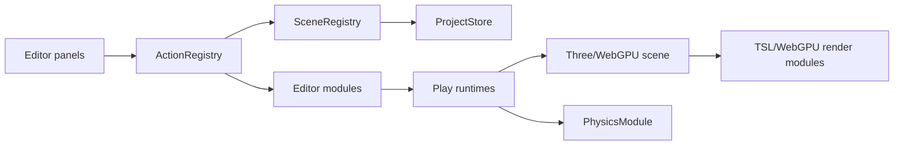

# GameStudio WebGPU Roadmap for Chill Drive Parity

**Planning status:** ready for approval; no feature implementation is included in this document.

**Target:** `experiments/webgpu/` only.

**Priority:** reach a small playable Chill Drive vertical slice early, then add parity in dependency order.

## 1. Non-negotiable baseline

Every milestone must keep these behaviors working:

- WebGPU renderer and TSL render pipeline.
- Existing Character and Vehicle asset cards/import flow.
- Character card and viewport selection, inspector, and XYZ TransformControls.
- Character Control with real Rapier movement: W/S, Q/E, Space; stable third-person and bone-preferred 1Person cameras.
- OrbitControls fully disabled while Character Control or 1Person owns the camera.
- Landscape, generated Terrain, Sculpt, Paint, Material Library, and Water Circle.
- Global Physics starts OFF.
- Ground/Road/Landscape remain static collision; Water remains non-dynamic.
- Reset Characters restores spawn transforms.
- Lighting, Time, camera presets/favorites, TSL DOF, and one-click focus.
- Browser autosave and migration of existing `wgpuSandbox.v2` data.
- Selecting an object does not move the camera. Camera changes happen only through an explicit camera/play action.

Original Chill Drive files under the project root remain read-only. Only approved, curated algorithms/data/assets are copied or adapted into `experiments/webgpu/`.

## 2. Target module boundaries

The target is a modular editor plus play runtime. It is not a rewrite of GameStudio and does not add an AI layer.

### Core services

| Service | Responsibility | First consumer |
| --- | --- | --- |
| `editor/core/ActionRegistry.js` | Named actions with argument validation and one execution path shared by buttons, shortcuts, and future automation | Road/Drive actions |
| `editor/core/SceneRegistry.js` | Stable entity IDs, category/type lookup, references, lifecycle registration, and selection-safe removal/duplication | Existing objects plus Road |
| `editor/core/ProjectStore.js` | Versioned serialize/migrate/restore, module-owned state, debounced autosave | `wgpuSandbox.v2` migration |
| `editor/core/RuntimeModeController.js` | Explicit edit/character-control/drive ownership of input, camera, TransformControls, OrbitControls, and physics stepping | Character Control and Drive |
| `editor/core/SelectionService.js` | Category-filtered card/viewport selection and inspector/gizmo attachment without camera movement | Existing selection flow |

These services should be extracted only as needed by the approved milestone. `main.js` remains the composition root, but it should stop owning new feature logic.

### Action contract

Each user operation should be a named action such as:

- `road.create`, `road.select`, `road.update`, `road.setEnabled`, `road.duplicate`, `road.delete`.
- `vehicle.bindDrive`, `drive.start`, `drive.stop`, `drive.setGear`.
- `camera.setVehicleMode`, `camera.updateVehiclePreset`.
- Later: `traffic.createProfile`, `weather.applyPreset`, `driver.bind`, `event.create`.

An action owns validation, mutation, serialization notification, and a small result object. DOM handlers call actions; they do not contain a second implementation. This makes features callable later without building AI-specific code now.

### Project data shape

The versioned project should contain plain data, not live Three/Rapier objects:

- `entities`: stable ID, type/category, transform, visibility, lock, asset reference, component settings.
- `systems`: road, drive, environment, time, traffic, quality, and camera profiles.
- `scene`: global lighting, camera/edit view, DOF, and Global Physics flag.
- `assets`: curated URL references; imported file metadata. Native IndexedDB can be introduced later for imported GLB bytes without a new dependency.

Procedural systems store parameters/seeds. Generated meshes are rebuilt. Sculpt/paint persistence should store a compact delta or authored asset only when that milestone is approved.

## 3. Editor workflows derived from the original runtime

### Road and drive workflow

1. In Landscape, choose **Create Road**.
2. The Road card and viewport mesh are immediately selectable; inspector and XYZ gizmo appear.
3. Configure seed/profile, lane width, shoulder, start distance, preview length, and dirt-road option.
4. Duplicate, enable/disable, or delete through registered actions. The active Drive Route is explicit when more than one road exists.
5. In Vehicle, select a compatible vehicle and choose **Bind to Drive Route**.
6. Choose **Control Vehicle** to enter play mode. This explicit action may activate the chase camera; ordinary asset selection never changes camera.
7. W/S changes target speed, A/D or arrows steer laterally, F cycles the speed tier, and Escape exits drive mode.

### Vehicle definition workflow

1. Select/import a Vehicle.
2. Configure its forward axis, physical dimensions, wheel node patterns, steering nodes, door node, eye/seat anchor, lamps, and material overrides.
3. Preview wheel steering, door, lights, and camera anchors as separate explicit actions.
4. Save as a vehicle definition referenced by player drive and traffic profiles.

The first milestone supports one curated Mustang definition. Generic calibration UI can be expanded after the runtime contract is proven.

### Camera workflow

1. Camera presets remain editable independently of object selection.
2. Vehicle camera profiles reference the active drive binding and expose pose, follow rate, near plane, focal length, and aperture.
3. **Preview Camera** and **Control Vehicle** are the only actions that take camera ownership.
4. Edit view is restored on exiting preview/play. OrbitControls then resumes.

### Terrain/map workflow

1. Existing finite authored Terrain and sculpt/paint continue to work.
2. A separate **Streaming Terrain** entity selects one of the original map profiles: reed, forest, mountain, meadow, or sea.
3. A Road reference controls road carve and height alignment.
4. Generated terrain and road collision are rebuilt as static colliders when relevant parameters change.

### Environment workflow

1. Weather and Time are system profiles, not scene meshes.
2. Applying a preset updates the shared environment state; sliders edit a copy of the selected profile.
3. Sky, clouds, precipitation, wetness, lighting, audio, and later post effects consume the same state rather than maintaining parallel values.

### Traffic workflow

1. Create a Traffic Profile and choose allowed vehicle definitions.
2. Configure direction counts, spawn intervals, speed range, and carriage inclusion.
3. Preview spawns only in play mode; editor cards represent definitions/profile state rather than every pooled runtime object.

### Driver workflow

1. Select a Character and Vehicle, then create a Driver Binding.
2. Configure seat, feet, wheel grip, head/eye, and animation clips.
3. Preview seated pose/IK without entering Character Control.
4. Character Control remains a separate standalone mode and never runs simultaneously with vehicle drive/driver preview.

### Event workflow

The original StopScene becomes a later event sequence built from explicit actions and runtime states. The current Event placeholder must not receive one-off StopScene code in `main.js`.

## 4. Recommended milestone order

| Order | Milestone | Result | Category | Migration difficulty |
| --- | --- | --- | --- | --- |
| 1 | Minimal Drive Vertical Slice | One editable procedural road, one Mustang, playable path driving, chase camera, persistence | REUSE + ADAPT | Medium–High |
| 2 | Streaming Terrain and Road Scenery | Original map height profiles, road carve, streamed terrain/road, static collision, basic roadside objects | REUSE + ADAPT | High |
| 3 | Environment, Time, Weather, Full Vehicle Cameras | Shared profiles, TSL sky/cloud/rain foundation, six vehicle cameras and lens transitions | ADAPT + REWRITE | High |
| 4 | Traffic and Audio | Two-way vehicles, policy/overtaking, pooling, engine/environment/pass-by sound | REUSE + ADAPT | Medium–High |
| 5 | Driver Binding, Animation, and IK | Character seated in vehicle with authored seat/wheel/foot/head calibration | ADAPT | High |
| 6 | Ocean and Waterfalls | Sea map ocean plus mountain streams, splashes, and water audio | REUSE + ADAPT + REWRITE | High |
| 7 | Cinematic Rendering | TSL post, wet reflection, height mist, mirrors, glass rain, wipers | REWRITE | Very High |
| 8 | Events and World Richness | Stop/exit sequence, carriage, towns, cows, fireflies, smoke, quality/mobile player shell | ADAPT + DEFERRED | High |

## 5. Milestone 1 — Minimal Drive Vertical Slice

### Scope

Deliver the smallest end-to-end slice that feels like Chill Drive while proving the editor architecture:

- One procedural Drive Route based on the original arc-length road math.
- A short streamed preview/drive road mesh with static collision and visible lane/edge treatment.
- One curated Mustang asset and a data-driven vehicle definition.
- Original-style path driving: target speed, speed tiers, lateral steering, road bounds, slope pitch, and curvature-aware yaw.
- One chase camera with explicit play ownership, follow smoothing, upper-body/car target, lens values, and clean edit-view restoration.
- Named actions and versioned persistence for road, drive binding, and vehicle camera settings.
- No traffic, weather parity, post effects, driver IK, AI, or vehicle rigid-body simulation in this milestone.

### Systems

- Core: SceneRegistry, ActionRegistry, ProjectStore migration, RuntimeModeController, SelectionService adapter.
- Road: pure path sampler, road mesh/chunk builder, Road editor module.
- Vehicle: Mustang definition, visual update, Drive binding.
- Drive: play input and path-state update.
- Camera: one chase profile and ownership handoff.
- Physics integration: Road remains fixed; Global Physics stays OFF; the path-owned car does not compete with generic Rapier stepping.

### Proposed files/modules

New files, limited to `experiments/webgpu/`:

- `editor/core/ActionRegistry.js`
- `editor/core/SceneRegistry.js`
- `editor/core/ProjectStore.js`
- `editor/core/RuntimeModeController.js`
- `editor/core/SelectionService.js`
- `editor/modules/RoadModule.js`
- `editor/modules/DriveModule.js`
- `editor/modules/VehicleModule.js`
- `runtime/RoadPath.js`
- `runtime/RoadMeshBuilder.js`
- `runtime/DriveController.js`
- `runtime/VehicleVisual.js`
- `runtime/VehicleCameraRig.js`
- `data/chillDriveVehicleDefinitions.js`
- `public/chill-drive/models/mustang.glb`

Existing files changed only for composition and migration:

- `main.js`: instantiate modules/services, register existing objects/actions, and call play runtime updates.
- `editor/modules/PhysicsModule.js`: only if a narrow API is required to suspend/restore a path-owned vehicle entry; do not change Character behavior.
- `package.json` only if a script is needed; no new dependency is expected.

### Dependencies

- Existing WebGPU renderer, scene, TransformControls, OrbitControls, persistence data, and editor panels.
- Original logic sources: `src/road.js`, the drive-state section of `src/main.js`, chase defaults in `src/camera.js`, Mustang data in `src/config.js`, and selected loading/visual rules from `src/cars.js`.
- Curated compressed Mustang asset copied into the target public directory.
- No dependency on original WebGL shaders, post pipeline, terrain streamer, or root `src` modules at runtime.

### Acceptance criteria

1. Landscape can create, select, move, configure, enable/disable, duplicate, and delete a Road entity.
2. Vehicle can select Mustang and bind/unbind it to the active Drive Route.
3. Card and viewport selection remain category-correct and show inspector + XYZ gizmo without moving the camera.
4. Starting vehicle control is explicit. It detaches TransformControls, disables OrbitControls, and activates chase follow.
5. W/S changes speed, A/D and arrows steer laterally, F cycles the configured speed tiers, and Escape returns to edit mode.
6. Vehicle pose follows road elevation, heading, and lateral offset; it stays inside the road bound.
7. Chase camera follows behind the car, targets the car/upper cabin, rotates with heading, and does not receive OrbitControls input.
8. Exiting control restores the prior edit camera and OrbitControls without changing the vehicle’s saved authored binding.
9. Reload restores Road settings, Drive binding, Mustang authored transform/settings, chase profile, and existing `wgpuSandbox.v2` content through migration.
10. Global Physics is OFF after a clean start. Ground/Road are static. Water is non-dynamic. Existing Character Control and Reset Characters still work.
11. No original Chill Drive source file is changed and no runtime imports a renderer-bound root module.

### Runtime tests

Run through HTTP with the Vite dev server and observe the real scene:

1. Open a clean browser state; confirm WebGPU scene loads and Global Physics reads OFF.
2. Character tab: select Venom by card and viewport; verify inspector/gizmo. Run W/S/Q/E/Space in third-person and 1Person; exit with Escape.
3. Landscape tab: create/select/duplicate/disable/enable/delete/restore as supported for Road; verify category-filtered viewport picking.
4. Vehicle tab: select Mustang, bind it, then start vehicle control. Observe W/S, A/D/arrows, F, road-bound steering, wheel/body visual response, and chase follow.
5. While driving, drag/wheel input must not activate OrbitControls. Escape must restore the exact edit camera.
6. Hide → Show Mustang and Road; cards return to normal opacity and each can be selected immediately.
7. Create a Water Circle and confirm it remains animated and non-dynamic; verify Landscape/Terrain tools still respond.
8. Toggle Global Physics ON/OFF once, then reset to OFF; confirm static Ground/Road and Character Reset behavior.
9. Reload the page and confirm migrated existing assets plus Road/Drive/Camera state restore without duplicate entities or console errors.
10. Test a second reload after an edit to prove autosave is stable, not a one-time migration artifact.

Static validation after runtime acceptance:

- `npx vite build`
- `git diff --check`
- Focused unit checks for Road sampling/curvature and ProjectStore migration.

### Migration difficulty

**Medium–High.** The pure road/drive math is straightforward. The work is in making play ownership, object references, and persistence explicit without regressing the current monolithic editor behavior.

### Category

**REUSE** road/drive math and calibration data; **ADAPT** vehicle loading/visuals, camera, input, persistence, and editor workflow.

## 6. Milestone 2 — Streaming Terrain and Road Scenery

### Scope

Add deterministic terrain map profiles, road-aligned height/carve, streamed terrain tiles, basic road chunks, posts/guardrails, and static collision around the active area. Preserve the existing authored Terrain and sculpt/paint path as a separate entity type.

### Systems

Road height provider, terrain noise/profile data, terrain streamer, road-scene chunks, collider window, map selection.

### Files/modules

`TerrainModule.js`, `runtime/TerrainNoise.js`, `runtime/TerrainStreamer.js`, `runtime/RoadScenery.js`, and a narrow static-collider API in `PhysicsModule.js`.

### Dependencies

Milestone 1 RoadPath/Drive Route and SceneRegistry; original `terrain-noise.js`, CPU portions of `terrain.js`, and geometry portions of `scenery.js`.

### Acceptance criteria

- Reed/forest/mountain/meadow/sea profiles produce deterministic heights.
- Road and terrain meet without gaps; car pose follows the same height source.
- Generated colliders are fixed, bounded near the player, and replaced without leaks.
- Existing finite Terrain Sculpt/Paint and Water Circle remain operational.
- Map settings persist and reload deterministically.

### Runtime tests

Drive forward through multiple chunk boundaries on each profile; inspect seams, collision, frame-time spikes, road carve, map switching, reload, and return to Character Control.

### Migration difficulty / category

**High — REUSE + ADAPT.** CPU noise and sampling are reusable; streaming lifecycle, editor schema, geometry ownership, and colliders require adaptation.

## 7. Milestone 3 — Environment, Time, Weather, and Full Vehicle Cameras

### Scope

Create one shared environment state; add editable weather/time profiles, TSL sky/cloud foundation, basic precipitation, lightning state, PMREM refresh policy, and all six vehicle cameras with per-mode lens transitions.

### Systems

EnvironmentModule, WeatherState, TimeModule, SkyNodes, PrecipitationNodes, VehicleCameraRig profiles.

### Files/modules

`editor/modules/EnvironmentModule.js`, `TimeModule.js`, `CameraModule.js`; `runtime/WeatherState.js`; `render/SkyNodes.js`, `PrecipitationNodes.js`.

### Dependencies

Milestone 1 camera ownership; Milestone 2 terrain/ocean height query contract. Original profile math from `world.js`, `config.js`, and camera behavior from `camera.js`.

### Acceptance criteria

Weather transitions share one state; time controls sun/moon/lighting; all camera modes follow the vehicle and transition pose/lens explicitly; selection still never changes camera; WebGPU console stays shader-error free.

### Runtime tests

Cycle every weather/time/camera while stationary and driving; test camera transitions, cockpit near plane, OrbitControls exclusion, precipitation movement, reload, and all baseline editor modes.

### Migration difficulty / category

**High — ADAPT + REWRITE.** State/profile logic adapts; sky/cloud/precipitation rendering moves to TSL/WebGPU.

## 8. Milestone 4 — Traffic and Audio

### Scope

Port two-way traffic policy and math, add pooled vehicle runtime instances, curve-speed behavior, player following/overtaking constraints, and renderer-independent WebAudio ambience/engine/pass-by sound.

### Systems

TrafficModule/Profile, TrafficPolicy, TrafficRuntime, pooled VehicleVisual, AudioModule/ChillAudio.

### Files/modules

`editor/modules/TrafficModule.js`, `AudioModule.js`; `runtime/TrafficPolicy.js`, `TrafficMath.js`, `TrafficRuntime.js`, `ChillAudio.js`.

### Dependencies

Road coordinates, Vehicle definitions, DriveController, environment state, and play-mode lifecycle.

### Acceptance criteria

Traffic spawns within profile limits, follows/avoids/overtakes without overlap, slows for curves, excludes the selected player vehicle definition when configured, pools cleanly, and emits correct pass-by/cabin/environment audio.

### Runtime tests

Observe same/opposite traffic at low and fast speeds, forced blocked lanes, overtake completion, curve slowdown, player stop obstacle, spawn/despawn/pool reuse, audio mode changes, and reload.

### Migration difficulty / category

**Medium–High — REUSE + ADAPT.** Decision logic is pure and already checked; scene pooling and editor/runtime references need adaptation.

## 9. Milestone 5 — Driver Binding, Animation, and IK

### Scope

Bind a Character definition to a Vehicle definition, map clips/bones, seat the driver, solve hands/feet against authored anchors, and feed the driver-eye camera. Keep standalone Character Control unchanged.

### Systems

CharacterModule extension, AnimationModule, DriverBinding, DriverIK, vehicle seat/wheel/foot/head anchors.

### Files/modules

`editor/modules/CharacterModule.js`, `AnimationModule.js`; `runtime/DriverBinding.js`, `DriverIK.js`.

### Dependencies

VehicleDefinition, camera ownership, animation mixer lifecycle, stable skeleton references.

### Acceptance criteria

Driver sits correctly, hands remain on steering wheel, feet remain on configured targets, wheel/arms turn together, cockpit camera uses head/eye world transform with face clearance, and switching back to standalone control leaves Rapier state valid.

### Runtime tests

Preview bindings, drive and steer in exterior/cockpit views, switch character where compatible, enter/exit driver preview repeatedly, then run both existing Character camera modes and Reset Characters.

### Migration difficulty / category

**High — ADAPT.** IK/state behavior is valuable, but bone names, animation clips, and vehicle calibration must become explicit data.

## 10. Milestone 6 — Ocean and Waterfalls

### Scope

Add the sea map ocean using the baked atlas and seam math; add seeded mountain streams/waterfalls, road crossing, foam/splash, and water audio.

### Systems

OceanModule/OceanNodes, WaterfallModule/Runtime, splash effects, sea/water height queries.

### Files/modules

`editor/modules/OceanModule.js`, `WaterfallModule.js`; `render/OceanNodes.js`, `WaterfallNodes.js`; `runtime/WaterfallRuntime.js`.

### Dependencies

Terrain/map profiles, RoadPath, environment lighting, AudioModule, player/traffic positions.

### Acceptance criteria

Ocean loops without a visible seam, stays world-stable, respects road/shore height, is non-dynamic, and persists. Waterfalls are deterministic, avoid road rocks, cross above asphalt, emit splash/audio, and clean up by chunk.

### Runtime tests

Observe the ocean loop across both seam phases and movement; switch sea/non-sea maps; drive through multiple seeded streams with player and NPC vehicles; inspect cleanup and reload.

### Migration difficulty / category

**High — REUSE + ADAPT + REWRITE.** Seam/geometry math is reusable; materials and particles require WebGPU implementations.

## 11. Milestone 7 — Cinematic Rendering

### Scope

Build WebGPU/TSL equivalents for cinematic post, height mist, wet-road reflection, mirrors, glass rain, and wipers. Add each pass independently behind a quality toggle.

### Systems

PostProcessModule, HeightMistNodes, WetReflectionPass, MirrorPass, GlassRainPass, WiperModule, quality profiles.

### Files/modules

`editor/modules/PostProcessModule.js`, `MirrorModule.js`, `WiperModule.js`; renderer code under `render/`.

### Dependencies

Stable environment state, vehicle glass/mirror anchors, camera profiles, road wetness, quality settings.

### Acceptance criteria

Each pass works under WebGPU, can be independently disabled, handles resize/quality changes, disposes targets, and has a measurable fallback. No GLSL `ShaderChunk` patch or WebGLRenderTarget remains in target code.

### Runtime tests

Resize, switch cameras/weather/quality, drive at all speed tiers, enter cockpit, inspect mirrors/wipers/reflections/mist, toggle every pass, and watch GPU/console stability over an extended run.

### Migration difficulty / category

**Very High — REWRITE.** Preserve visual intent and state inputs; rebuild the renderer implementation.

## 12. Milestone 8 — Events and World Richness

### Scope

Build generic event sequencing, then express Stop/exit/wander/return through it. Add carriage, towns, cattle, fireflies, smoke, near-detail nature, full quality profiles, and a compact player shell only after their dependencies are stable.

### Systems

EventModule, StopSequence, Carriage definition, Town/Cow/Firefly/Smoke/Nature modules, QualityModule, PlayerShell.

### Files/modules

Independent editor/runtime modules per system; no additions to `main.js` beyond composition.

### Dependencies

Drive, traffic, driver binding, environment, audio, rendering passes, persistence, and runtime-mode ownership.

### Acceptance criteria

Event sequences serialize and recover safely; StopScene behavior no longer owns global DOM/input directly; world modules are individually configurable/disableable; quality profiles adjust all consumers consistently.

### Runtime tests

Run the full stop/return sequence, camera input hold/zoom, traffic/person obstacle handling, map-specific world modules, quality changes, mobile orientation/fullscreen, reload mid-editor state, and a long play soak.

### Migration difficulty / category

**High — ADAPT plus previously DEFERRED systems.**

## 13. Required validation at every milestone

1. Run focused logic tests for changed renderer-independent algorithms.
2. Run the Vite app over HTTP and observe every changed workflow in the actual WebGPU canvas.
3. Re-test card selection and viewport selection in each affected category.
4. Re-test inspector, XYZ gizmo, Hide → Show appearance/selection, and explicit camera ownership.
5. Re-test Character Control W/S/Q/E/Space, third-person, 1Person, Reset Characters, and OrbitControls exclusion.
6. Confirm Global Physics defaults OFF; Ground/Road/Landscape are static; Water is non-dynamic.
7. Reload twice to verify migration and autosave stability.
8. Run `npx vite build` and `git diff --check` once after focused runtime validation passes.

## 14. Approval boundary

The recommended first implementation is **Milestone 1 — Minimal Drive Vertical Slice**. Work should stop at this plan until that milestone is explicitly approved. No AI layer, traffic, shader parity, StopScene, world dressing, or unrelated UI redesign belongs in that approval.
